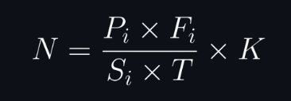

# Chapter 3: From Concept to Creation

## Introduction

Implementing a universal reward system necessitates a scalable and flexible infrastructure that meets the requirements of sellers while ensuring a seamless experience for customers. This chapter delineates the step-by-step process, from conceptualization to technical execution, to develop a unified rewards platform. The design emphasizes normalizing points across businesses, integrating sales data, and ensuring security and scalability.

---

### Step 1: Creating a Unified Rewards Blockchain (URB)

To ensure transparency, security, and decentralization, the universal rewards system will utilize blockchain technology. The blockchain will function as a ledger for all reward transactions, enabling traceability and fraud prevention.

#### Key Features

1. **Ledger Transparency:** Every transaction is recorded on the blockchain, ensuring clarity for sellers and customers.
2. **Smart Contracts:** Smart contracts will manage reward distribution, normalization, and redemption.
3. **Scalability:** Employ a Proof-of-Stake (PoS) consensus mechanism to minimize computational overhead and energy consumption.

#### Technical Details

- **Blockchain Network:** A private, permissioned blockchain using Hyperledger Fabric.
- **Smart Contract Design:** Contracts written in Solidity will:
  - Convert raw reward points into Universal Reward Tokens (URTs).
  - Handle redemption requests and validate seller contributions.

---

### Step 2: Normalizing Reward Points

Reward points vary in value across businesses. A standard normalization algorithm will ensure fair conversion into Universal Reward Tokens (URTs).

#### Algorithm

Let:

Formula:

   

Implementation:

1. **Calculation:** The system executes the normalization algorithm on the backend, utilizing data stored in a relational database (e.g., PostgreSQL).
2. **Token Conversion:** Customers’ points are converted to URTs and stored in their digital wallets.

---

### Step 3: Building the Digital Wallet

The digital wallet will serve as the core interface for customers and sellers to manage rewards.

#### Features

1. **Multi-Seller Support:** Customers can view and redeem points across multiple sellers.
2. **Real-Time Updates:** Provide instant updates on rewards balance after transactions.

#### Technical Stack

- **Frontend:** React Native for a cross-platform mobile app.
- **Backend:** Node.js with Express for API development.
- **Database:** MongoDB for storing wallet and transaction data.
- **Security:** Implement JWT for authentication and AES-256 for encrypting sensitive data.
- **Transactions:** Solidity

---

### Step 4: Integrating with Sellers’ POS Systems

To ensure a seamless experience, the universal reward system must integrate with existing POS systems.

#### Integration Steps

1. **API Development:**
   - Develop RESTful APIs to handle reward point validation and redemption processes.
   - Offer SDKs to facilitate seamless integration with popular POS systems.

#### Template API Format

Below is a basic template for the API endpoints that the server should handle:

**Endpoint:** `/api/rewards/validate`

- **Method:** POST
- **Description:** Validates the reward points for a given transaction.
- **Request Body:**
  - seller_id
  - transaction_id
  - points
- **Response:**
  - status
  - message
  - normalized_points

**Endpoint:** `/api/rewards/redeem`

- **Method:** POST
- **Description:** Redeems reward points for a customer.
- **Request Body:**
  - customer_id
  - seller_id
  - points_to_redeem
- **Response:**
  - status
  - message
  - remaining_balance

**Endpoint:** `/api/rewards/balance`

- **Method:** GET
- **Description:** Retrieves the current reward points balance for a customer.
- **Request Parameters:**
  - customer_id
- **Response:**
  - status
  - balance

These endpoints provide the basic functionality required for validating, redeeming, and checking the balance of reward points within the universal rewards system.

2. **Middleware:**

   ### Middleware Development

   To bridge the gap between sellers' existing systems and the Universal Rewards Blockchain (URB), middleware solutions are essential. These middleware components will ensure smooth data translation and communication between disparate systems.

   #### Middleware Components

   1. **Data Translation Layer:**
      - **Function:** Converts data formats from sellers' POS systems to the format required by the URB.
      - **Implementation:** Use data transformation tools like Apache Camel or custom scripts in Node.js to handle data mapping and conversion.

   2. **API Gateway:**
      - **Function:** Acts as a single entry point for all API requests from sellers' systems to the URB.
      - **Implementation:** Deploy an API gateway like Kong or AWS API Gateway to manage and route API requests efficiently.

   3. **Message Queue:**
      - **Function:** Ensures reliable and asynchronous communication between sellers' systems and the URB.
      - **Implementation:** Use message queuing services like RabbitMQ or Apache Kafka to handle high-throughput and fault-tolerant message delivery.

   4. **Authentication and Authorization:**
      - **Function:** Secures API endpoints and ensures that only authorized systems can interact with the URB.
      - **Implementation:** Implement OAuth 2.0 and JWT for secure authentication and authorization of API requests.

   #### Middleware Workflow

   1. **Request Handling:**
      - Seller's POS system sends a request to the middleware.
      - Middleware validates the request and authenticates the sender.

   2. **Data Translation:**
      - Middleware translates the request data into the format required by the URB.

   3. **API Gateway Routing:**
      - Translated request is routed through the API gateway to the appropriate URB endpoint.

   4. **Response Handling:**
      - URB processes the request and sends a response back to the middleware.
      - Middleware translates the response data back to the seller's format and sends it to the seller's POS system.

   5. **Logging and Monitoring:**
      - Middleware logs the transaction details and monitors the communication for any errors or anomalies.

   By implementing these middleware components, the integration between sellers' existing systems and the URB will be seamless, ensuring efficient and secure data exchange.
3. **Testing:**
    - Conduct sandbox testing with each seller before live deployment.

#### Example API Workflow

1. **Validation:**
   - **Request:** Seller’s POS system sends a POST request to the `/api/rewards/validate` endpoint with the transaction details, including `seller_id`, `transaction_id`, and `points`.
   - **Middleware Processing:** The middleware receives the request, authenticates the sender using OAuth 2.0, and translates the data into the format required by the URB.
   - **Blockchain Interaction:** The translated request is routed through the API gateway to the URB, where the smart contract validates the transaction details and calculates the normalized points.
   - **Response Generation:** The URB generates a response with the normalized points and updates the blockchain ledger to reflect the transaction.

2. **Response:**
   - **Middleware Handling:** The URB sends the response back to the middleware, which translates the data back into the seller's format.
   - **API Response:** The middleware sends the response to the seller’s POS system, including the `status`, `message`, and `normalized_points`.
   - **POS Update:** The seller’s POS system updates the customer’s reward balance in real-time and provides feedback to the customer.

This workflow ensures secure, efficient, and transparent handling of reward point validation and normalization, leveraging blockchain technology for traceability and fraud prevention.

### Step 5: Ensuring Security and Compliance

Security and compliance are critical for gaining seller trust and ensuring customer data privacy.

#### Security Measures

1. **Encryption:**
    - Use HTTPS for data transmission.
    - Encrypt all sensitive data at rest and in transit.
2. **Authentication:**
    - Implement multi-factor authentication (MFA) for customer accounts.
    - Use OAuth 2.0 for secure API access.
3. **Fraud Detection:**
    - Deploy machine learning models to detect anomalous transactions.
