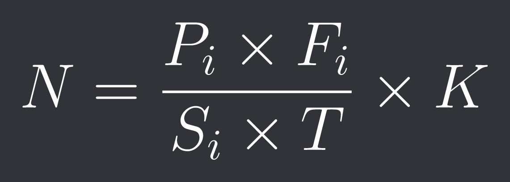

# Chapter 3: From Concept to Creation

## Introduction

Implementing a universal reward system necessitates a scalable and flexible infrastructure that meets the requirements of sellers while ensuring a seamless experience for customers. This chapter delineates the step-by-step process, from conceptualization to technical execution, to develop a unified rewards platform. The design emphasizes normalizing points across businesses, integrating sales data, and ensuring security and scalability.

---

### Step 1: Creating a Unified Rewards Blockchain (URB)

To ensure transparency, security, and decentralization, the universal rewards system will utilize blockchain technology. The blockchain will function as a ledger for all reward transactions, enabling traceability and fraud prevention.

#### Key Features

1. **Ledger Transparency:** Every transaction is recorded on the blockchain, ensuring clarity for sellers and customers.
2. **Smart Contracts:** Smart contracts will manage reward distribution, normalization, and redemption.
3. **Scalability:** Employ a Proof-of-Stake (PoS) consensus mechanism to minimize computational overhead and energy consumption.

#### Technical Details

- **Blockchain Network:** A private, permissioned blockchain using Hyperledger Fabric.
- **Smart Contract Design:** Contracts written in Solidity will:
   - Convert raw reward points into Universal Reward Tokens (URTs).
   - Handle redemption requests and validate seller contributions.
   - Normalize reward points based on a predefined formula.

---

### Step 2: Normalizing Reward Points

Reward points vary in value across businesses. A standard normalization algorithm will ensure fair conversion into Universal Reward Tokens (URTs).

#### Algorithm

Let:
- \( P_i \) = Points earned at Seller \( i \) 
- \( S_i \) = Monthly sales of Seller \( i \) 
- \( F_i \) = Frequency of customer transactions at Seller \( i \)
- \( N \) = Normalized value in URTs
- \( T \) = Total transaction volume across all sellers
- \( K \) = Scaling constant for standardization

Formula:

Implementation:

1. **Data Collection:** Sellers submit monthly sales and transaction data to the platform.
2. **Calculation:** The system executes the normalization algorithm on the backend, utilizing data stored in a relational database (e.g., PostgreSQL).
3. **Token Conversion:** Customers’ points are converted to URTs and stored in their digital wallets.

---

### Step 3: Building the Digital Wallet

The digital wallet will serve as the core interface for customers and sellers to manage rewards.

#### Features

1. **Multi-Seller Support:** Customers can view and redeem points across multiple sellers.
2. **QR Code Integration:** Utilize QR codes for quick redemption at point-of-sale (POS) systems.
3. **Real-Time Updates:** Provide instant updates on rewards balance after transactions.

#### Technical Stack

- **Frontend:** React Native for a cross-platform mobile app.
- **Backend:** Node.js with Express for API development.
- **Database:** MongoDB for storing wallet and transaction data.
- **Security:** Implement JWT for authentication and AES-256 for encrypting sensitive data.

---

### Step 4: Integrating with Sellers’ POS Systems

To ensure a seamless experience, the universal reward system must integrate with existing POS systems.

#### Integration Steps

1. **API Development:**
   - Develop RESTful APIs to handle reward point validation and redemption processes.
   - Offer SDKs to facilitate seamless integration with popular POS systems.

#### Template API Format

Below is a basic template for the API endpoints that the server should handle:

**Endpoint:** `/api/rewards/validate`
- **Method:** POST
- **Description:** Validates the reward points for a given transaction.
- **Request Body:**
  - seller_id
  - transaction_id
  - points
- **Response:**
  - status
  - message
  - normalized_points

**Endpoint:** `/api/rewards/redeem`
- **Method:** POST
- **Description:** Redeems reward points for a customer.
- **Request Body:**
  - customer_id
  - seller_id
  - points_to_redeem
- **Response:**
  - status
  - message
  - remaining_balance

**Endpoint:** `/api/rewards/balance`
- **Method:** GET
- **Description:** Retrieves the current reward points balance for a customer.
- **Request Parameters:**
  - customer_id
- **Response:**
  - status
  - balance

These endpoints provide the basic functionality required for validating, redeeming, and checking the balance of reward points within the universal rewards system.

2. **Middleware:**
    - Develop middleware solutions to bridge the gap between sellers' existing systems and the URB, ensuring smooth data translation and communication.
3. **Testing:**
    - Conduct sandbox testing with each seller before live deployment.

#### Example API Workflow

1. **Validation:** Seller’s POS sends a request to the URB API with transaction details.
2. **Response:** API returns normalized points and updates the blockchain.

---

### Step 5: Ensuring Security and Compliance

Security and compliance are critical for gaining seller trust and ensuring customer data privacy.

#### Security Measures

1. **Encryption:**
    - Use HTTPS for data transmission.
    - Encrypt all sensitive data at rest and in transit.
2. **Authentication:**
    - Implement multi-factor authentication (MFA) for customer accounts.
    - Use OAuth 2.0 for secure API access.
3. **Fraud Detection:**
    - Deploy machine learning models to detect anomalous transactions.

#### Compliance

1. **Data Privacy:** Adhere to GDPR and CCPA regulations.
2. **Auditing:** Conduct regular third-party audits of the blockchain and backend systems.

---

### Step 6: Launching and Scaling the System

A phased rollout will ensure smooth implementation and adoption.

#### Phases

1. **Pilot Program:**
    - Collaborate with a small group of sellers for initial testing.
    - Gather feedback and optimize the system.
2. **Full Launch:**
    - Gradually onboard more sellers and customers.

#### Continuous Improvement

1. **Regular Algorithm Updates:** Regularly update algorithms to reflect market trends. This ensures that the normalization process remains fair and relevant as market conditions change. By analyzing sales data, customer behavior, and economic indicators, the system can adjust the normalization formula to maintain balance and fairness across all sellers.

2. **Dynamic Point Values:** Introduce features like dynamic point values during promotional events. This allows sellers to offer special promotions where reward points can have higher values for a limited time. For example, during a holiday sale, points earned could be worth double their normal value. This flexibility can drive customer engagement and increase the volume of sales during key periods.

---
